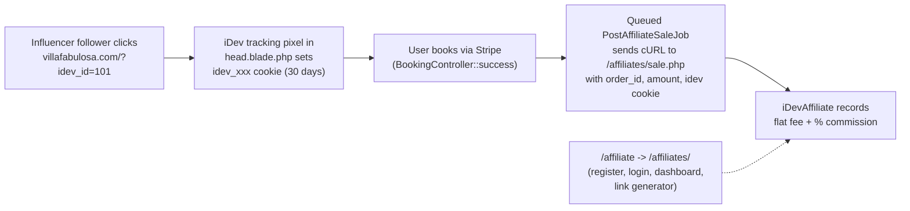

# iDevAffiliate Integration Plan

## Context recap

- **Payments are Stripe, not PayPal.** `BookingController::createPaymentIntent` / `success` in [app/Http/Controllers/BookingController.php](app/Http/Controllers/BookingController.php) use `Stripe\PaymentIntent`. We cannot use the IPN method in the iDev brief; instead we use iDev's generic server-to-server postback to `sale.php` — this is Stripe-equivalent of the "IPN forwarding" approach and still gives us server-to-server reliability.
- **Commission trigger (per your answer):** fire once on booking creation, based on `$booking->total` (full total, even for deferred 50/50 bookings).
- **Cookie window:** 30 days (set in iDev admin).
- **Hosting:** self-host iDevAffiliate at `public/affiliates/` on the same server, sharing the existing MySQL DB (iDev uses its own `idev_*` tables). Simplest, cheapest (one-time license), and keeps everything under `villafabulosa.com`. Your Laravel route `/affiliate` will redirect to `/affiliates/` (iDev's default folder layout).

## Flow



## Work breakdown

### 1. Install & configure iDevAffiliate (ops/manual, not code)

- Purchase the one-time license, download the zip.
- Upload into `public/affiliates/` (Laravel's `public/` serves real directories before hitting the router, so no route conflict).
- Run the iDev installer pointing at the existing MySQL DB; accept the default `idev_*` table prefix (no collision with Laravel tables).
- In iDev Admin -> Settings:
  - **Cookie Duration = 30**.
  - **Commission Structure = Flat Fee + Percent** (enter the per-booking flat fee and % you want).
  - **Cart Integration = Generic / sale.php postback** (do NOT pick PayPal IPN - we're on Stripe).
  - Note the `SALEPOSTBACK_SECRET` / "Sale Postback Key" iDev generates; we'll put it in `.env`.
- Apply a luxury skin via Templates menu to match Villa Fabulosa branding.

### 2. Global tracking pixel

Edit [resources/views/layouts/partials/head.blade.php](resources/views/layouts/partials/head.blade.php) and add iDev's JS tracking snippet just after the existing Google Tag blocks, wrapped so it only loads when enabled:

```blade
@if (config('services.idevaffiliate.enabled'))
    <script src="{{ config('services.idevaffiliate.url') }}/tracking.js"></script>
@endif
```

This one-liner sets the 30-day `idev_*` cookie on every page view the moment a visitor lands with `?idev_id=NN` (iDev's default link format).

### 3. Routes

Edit [routes/web.php](routes/web.php):

```php
Route::get('/affiliate', fn () => redirect('/affiliates/'))->name('affiliate');
```

No controller needed - iDevAffiliate owns `/affiliates/*` (register, login, dashboard, stats, link generator) as static PHP served from `public/affiliates/`.

### 4. Server-to-server conversion postback

Add config in [config/services.php](config/services.php):

```php
'idevaffiliate' => [
    'enabled' => env('IDEVAFFILIATE_ENABLED', false),
    'url'     => env('IDEVAFFILIATE_URL'),       // e.g. https://villafabulosa.com/affiliates
    'secret'  => env('IDEVAFFILIATE_SECRET'),    // sale postback key from iDev admin
],
```

Add to [.env.example](.env.example):

```env
IDEVAFFILIATE_ENABLED=false
IDEVAFFILIATE_URL=https://villafabulosa.com/affiliates
IDEVAFFILIATE_SECRET=
```

Create `app/Jobs/PostAffiliateSale.php` (new, queued) that POSTs to `{IDEVAFFILIATE_URL}/sale.php` with the fields iDev expects:

- `idev_saleamt` = booking total (full total, not deposit)
- `idev_ordernum` = `$booking->id` (unique)
- `profile` = optional product/category (e.g. `villa-fabulosa`)
- plus the visitor's iDev cookie value passed from the request

Hook it from `BookingController::success()` in [app/Http/Controllers/BookingController.php](app/Http/Controllers/BookingController.php), right after each `firstOrCreate` block, guarded by `$booking->wasRecentlyCreated` so page reloads never double-post:

```php
if ($booking->wasRecentlyCreated && config('services.idevaffiliate.enabled')) {
    PostAffiliateSale::dispatch(
        orderId: $booking->id,
        amount:  (float) $booking->total,
        idevCookie: $request->cookie('idev_saleid')
                 ?? $request->cookie('idevaffiliate'),
    );
}
```

The queued job is used because the success page shouldn't block on an outbound HTTP call; failures get retried automatically. Commissions fire on `$booking->total` for both `full` and `deferred` payment types, matching your "lock the commission in on day 1" decision.

### 5. Conversion pixel fallback

Edit [resources/views/frontend/booking-success.blade.php](resources/views/frontend/booking-success.blade.php) to add iDev's client-side conversion pixel just before `@endsection`:

```blade
@if (config('services.idevaffiliate.enabled') && !empty($amountPaid))
    total ?? $amountPaid }}&idev_ordernum={{ $piId }}"
         width="1" height="1" alt="" style="display:none" />
@endif
```

This is belt-and-suspenders: the server-to-server job is the source of truth; the pixel is iDev's native fallback in case the job is misconfigured.

### 6. Audit trail (small schema addition)

Add a migration mirroring the pattern in `database/migrations/2026_04_20_000001_add_guest_note_to_bookings_table.php`:

- `affiliate_cookie` (nullable string) - snapshot of iDev cookie at booking time
- `affiliate_posted_at` (nullable timestamp) - when the job successfully posted
- `affiliate_commission_id` (nullable string) - iDev's response ID, for future reversal/refunds

Update `$fillable` and `$casts` in [app/Models/Booking.php](app/Models/Booking.php) and surface "Affiliate" row(s) on [resources/views/admin/bookings/show.blade.php](resources/views/admin/bookings/show.blade.php) so admins can see which bookings came from affiliates.

### 7. Testing checklist

- Install iDev, create affiliate account #101 in admin, copy generated link `villafabulosa.com/?idev_id=101`.
- Visit that link in an incognito window; confirm `idev_*` cookie is set with 30-day expiry.
- Make a test booking with Stripe test card (`4242 4242 4242 4242`) from the same browser.
- Confirm iDev admin -> Pending Commissions shows the new entry with flat-fee + % correctly calculated from `$booking->total`.
- Repeat for a deferred booking: commission should also equal `total`, posted immediately, not waiting for balance charge.
- Reload the success page: no duplicate commission (guarded by `wasRecentlyCreated`).

## Out of scope for this first cut

- Refund / cancellation reversal. iDev's REST API supports marking a commission reversed; we can add that later by hooking an admin "cancel booking" action. Flag if you want it in-scope now.
- Payout management - iDevAffiliate handles that internally (PayPal mass-pay / manual) in its own admin.
- Multi-tier / sub-affiliates.
